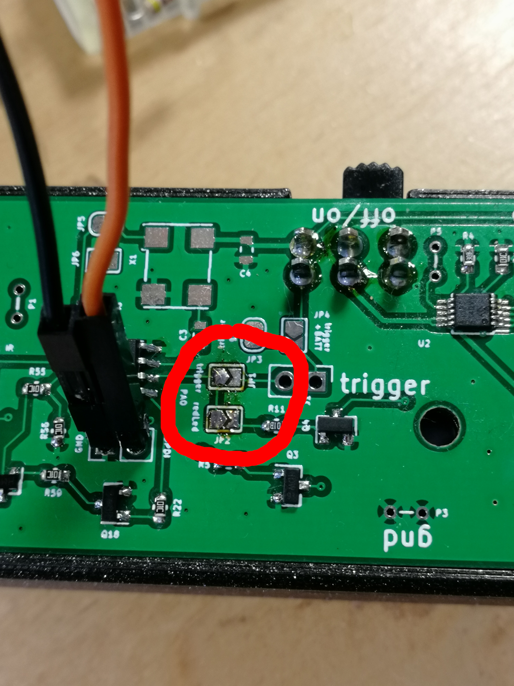
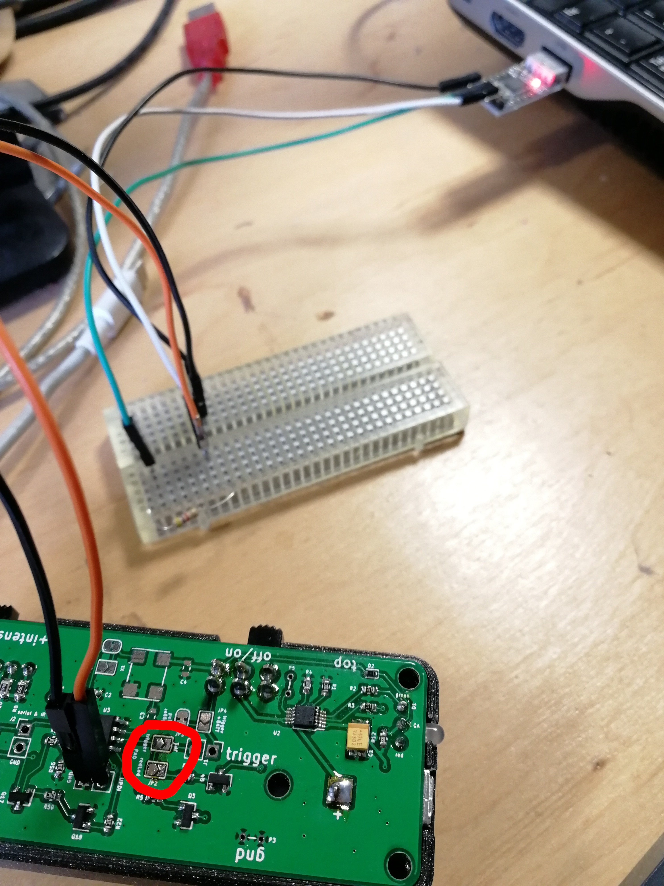

So this is the firmware for the transmitter part of the project. The earlier version of the firmware used two multivibrators, but it proved to be less flexible (and even more expensive) than a µC.

# Links
* [The µC used](http://ww1.microchip.com/downloads/en/DeviceDoc/ATtiny202-402-DataSheet-DS40001969B.pdf)

# How to build
Select attiny402 kit in vscode. It uses the official compiler from microchip (ancient version of GCC 5.3.0 or something) and something called the atpack.

* [Here they discuss how to build with avr-gcc. CRUCIAL TO READ](https://www.avrfreaks.net/forum/solved-compiling-attiny1607-or-other-0-series1-series-avr-gcc).
  * Better use [the official compiler](https://www.microchip.com/mplab/avr-support/avr-and-arm-toolchains-c-compilers).

# How to flash
* Grab [this](https://github.com/mraardvark/pyupdi).
* `sudo python ./setup.py install`
* Connect everything as described in the README.md from pyupdi.
* JP1 and JP2 solder jumpers have to be open. See picture below.
* Issue the command:

``` sh
~/Downloads/pyupdi/pyupdi.py -d tiny402 -c /dev/ttyUSB0 -f build/transmitter.hex
```




# TODO
* [x] IR signal
* [x] Green blinks when device is turned on.
* [x] Test trigger (I would say it's a kind of a masking signal. When high, the IR stops.). Interrupt driven.
* [x] Battery sensing
  * [ ] Blink redLed when +BATT drops below certain level (3V?) PA0 is internally pulled UP because it acts as a ~RESET. Probably turning the fuse bit OFF (to 0x00) would switch that off, or at least enable the GPIO functionality on this, but pyupdi is not able to do it.
  * [x] Go to sleep. EDIT : it sleeps but current draw is very high.